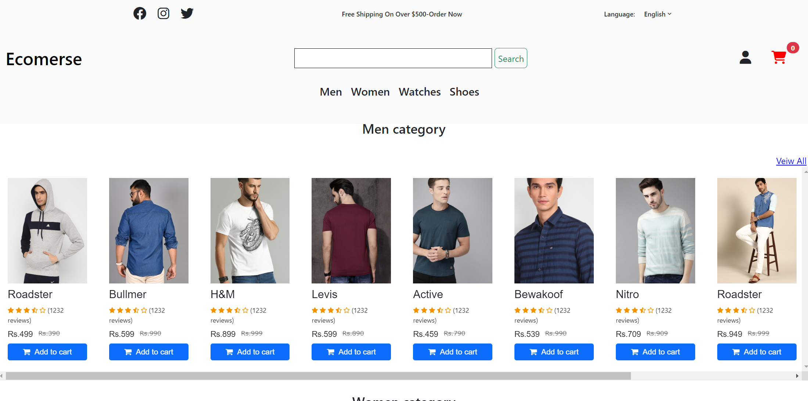
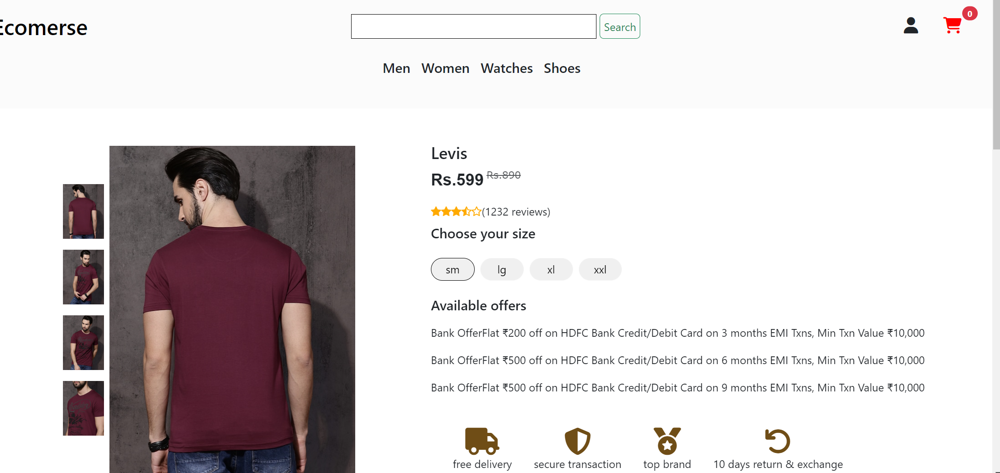
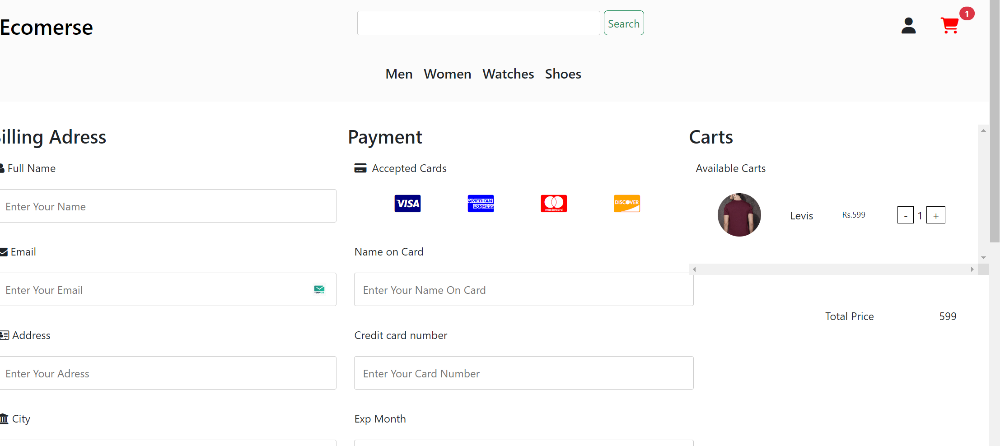

# E-commerce Website - README

LIVE DEMO -

<a href="https://rakeshdevarakonda.github.io/Ecomerse-Website/">Click Here To Veiw The Live Demo</a>

#some pictures

Welcome to our E-commerce website! This website allows users to browse and purchase products, view product details, and use local storage to manage their shopping cart.

## Features

- **Product Browsing**: Users can browse a list of available products.

- **Product Details**: Users can click on a product to see its details.

- **Add to Cart**: Users can add products to their shopping cart.

- **View Cart**: Users can view the contents of their shopping cart.

- **Checkout**: Users can proceed to checkout and make a purchase.

## Usage

1. **Browsing Products**:

   - On the homepage, you can see a list of available products.
   - Click on a product to view its details.

2. **Adding Products to Cart**:

   - On the product details page, you can click the "Add to Cart" button to add the product to your cart.

3. **Viewing Cart**:

   - Click on the "Cart" icon to view the contents of your shopping cart.

4. **Checkout**:
   - From the cart page, click the "Checkout" button to proceed to checkout.
   - Enter your shipping and payment information.
   - Click "Place Order" to complete your purchase.

## Local Storage

This website uses local storage to store the contents of the shopping cart. This means that your cart items will persist even if you close your browser. Please note that local storage has limitations, and your cart may be lost if you clear your browser's data.

## Technologies Used

- HTML, CSS, JavaScript Bootstrap and Jqueey.
- Local Storage for managing the shopping cart.
